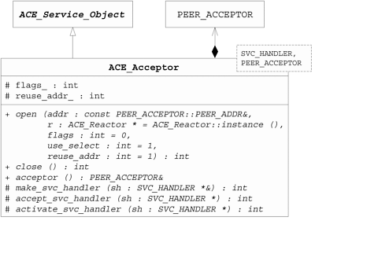
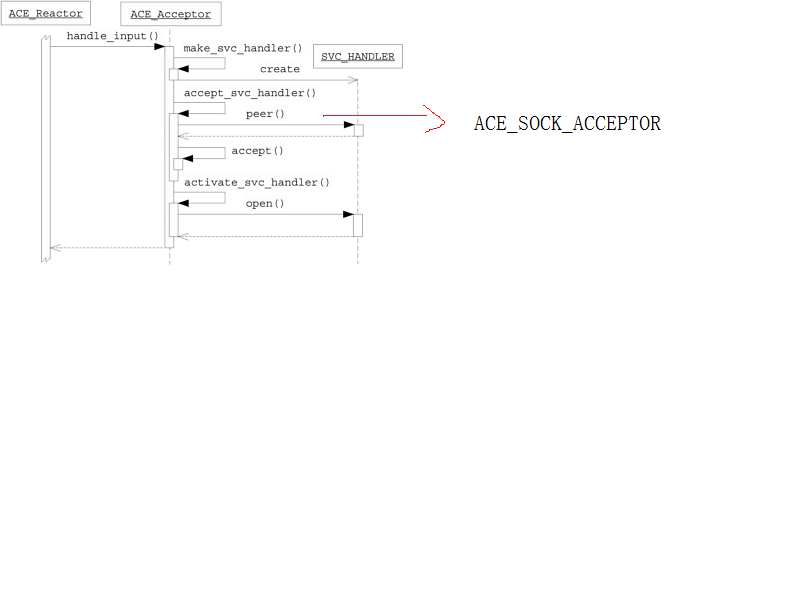

1.



An SVC_HANDLER class, which provides an interface for processing services defined by clients, servers, or both client and server roles in peer-to-peer services. This parameter is instantiated by a subclass of the ACE_Svc_Handler class described in Section 7.2.

A PEER_ACCEPTOR class, which is able to accept client connections passively. This parameter is often specified as one of the ACE IPC wrapper facades, such as the ACE_SOCK_Acceptor described in Chapter 3 of C++NPv1.



Aceptor.cpp:389
```cpp
  do
    {
      // Create a service handler, using the appropriate creation
      // strategy.

      SVC_HANDLER *svc_handler = 0;

      if (this->make_svc_handler (svc_handler) == -1)
        {
          if (ACE::debug ())
            {
              ACE_DEBUG ((LM_DEBUG,
                          ACE_TEXT ("%p\n"),
                          ACE_TEXT ("make_svc_handler")));
            }
          return 0;
        }
      // Accept connection into the Svc_Handler.
      else if (this->accept_svc_handler (svc_handler) == -1)
        {
          // Note that <accept_svc_handler> closes the <svc_handler>
          // on failure.
          if (ACE::debug ())
            {
              ACE_DEBUG ((LM_DEBUG,
                          ACE_TEXT ("%p\n"),
                          ACE_TEXT ("accept_svc_handler")));
            }
          const int ret = this->handle_accept_error ();
          if (ret == -1)
            {
              // Ensure that the errno from the above call propegates.
              error = errno;
            }
          return ret;
        }
      // Activate the <svc_handler> using the designated concurrency
      // strategy (note that this method becomes responsible for
      // handling errors and freeing up the memory if things go
      // awry...).
      else if (this->activate_svc_handler (svc_handler) == -1)
        {
          // Note that <activate_svc_handler> closes the <svc_handler>
          // on failure.

          if (ACE::debug ())
            {
              ACE_DEBUG ((LM_DEBUG,
                          ACE_TEXT ("%p\n"),
                          ACE_TEXT ("activate_svc_handler")));
            }
          return 0;
        }
      // Now, check to see if there is another connection pending and
      // break out of the loop if there is none.
    } while (this->use_select_ &&
             ACE::handle_read_ready (listener, &timeout) == 1);
```			 


SOCK_Acceptor.cpp:110
```cpp
// General purpose routine for accepting new connections.

int
ACE_SOCK_Acceptor::accept (ACE_SOCK_Stream &new_stream,
                           ACE_Addr *remote_addr,
                           ACE_Time_Value *timeout,
                           bool restart,
                           bool reset_new_handle) const
{
  ACE_TRACE ("ACE_SOCK_Acceptor::accept");

  int in_blocking_mode = 0;
  if (this->shared_accept_start (timeout,
                                 restart,
                                 in_blocking_mode) == -1)
    return -1;
  else
    {
      // On Win32 the third parameter to <accept> must be a NULL
      // pointer if we want to ignore the client's address.
      int *len_ptr = 0;
      sockaddr *addr = 0;
      int len = 0;

      if (remote_addr != 0)
        {
          len = remote_addr->get_size ();
          len_ptr = &len;
          addr = (sockaddr *) remote_addr->get_addr ();
        }

      do
        new_stream.set_handle (ACE_OS::accept (this->get_handle (),
                                               addr,
                                               len_ptr));
      while (new_stream.get_handle () == ACE_INVALID_HANDLE
             && restart
             && errno == EINTR
             && timeout == 0);

      // Reset the size of the addr, so the proper UNIX/IPv4/IPv6 family
      // is known.
      if (new_stream.get_handle () != ACE_INVALID_HANDLE
          && remote_addr != 0)
        {
          remote_addr->set_size (len);
          if (addr)
            remote_addr->set_type (addr->sa_family);
        }
    }

  return this->shared_accept_finish (new_stream,
                                     in_blocking_mode,
                                     reset_new_handle);
}
```	

#0  ACE_SOCK_Acceptor::accept (this=0x7fffffffe548, new_stream=..., remote_addr=0x0, timeout=0x0, restart=true, 
    reset_new_handle=false) at ../../ace/SOCK_Acceptor.cpp:110
	
#1  0x0000000000408ecd in ACE_Acceptor<MyServiceHandler, ACE_SOCK_Acceptor>::accept_svc_handler (this=0x7fffffffe510, 
    svc_handler=0x61d5a0) at /usr/local/include/ace/Acceptor.cpp:304
	
#2  0x0000000000408b0e in ACE_Acceptor<MyServiceHandler, ACE_SOCK_Acceptor>::handle_input (this=0x7fffffffe510, 
    listener=5) at /usr/local/include/ace/Acceptor.cpp:407
	
#3  0x00007ffff7ae78e4 in ACE_Select_Reactor_T<ACE_Reactor_Token_T<ACE_Token> >::notify_handle (this=0x615930, handle=5, 
    mask=1, ready_mask=..., event_handler=0x7fffffffe510, ptmf=&virtual table offset 48)
    at ../../ace/Select_Reactor_T.cpp:813
	
#4  0x00007ffff7ae5f7e in ACE_Select_Reactor_T<ACE_Reactor_Token_T<ACE_Token> >::dispatch_io_set (this=0x615930, 
    number_of_active_handles=1, number_of_handlers_dispatched=@0x7fffffffe3e0: 1, mask=1, dispatch_mask=..., 
    ready_mask=..., callback=&virtual table offset 48) at ../../ace/Select_Reactor_T.cpp:1197
#5  0x00007ffff7ae34c8 in ACE_Select_Reactor_T<ACE_Reactor_Token_T<ACE_Token> >::dispatch_io_handlers (this=0x615930, 
    dispatch_set=..., number_of_active_handles=@0x7fffffffe3dc: 1, number_of_handlers_dispatched=@0x7fffffffe3e0: 1)
    at ../../ace/Select_Reactor_T.cpp:1260
#6  0x00007ffff7ae5317 in ACE_Select_Reactor_T<ACE_Reactor_Token_T<ACE_Token> >::dispatch (this=0x615930, 
    active_handle_count=1, dispatch_set=...) at ../../ace/Select_Reactor_T.cpp:1362
#7  0x00007ffff7ae4db1 in handle_events_i (max_wait_time=0x0, this=0x615930) at ../../ace/Select_Reactor_T.cpp:1439
#8  ACE_Select_Reactor_T<ACE_Reactor_Token_T<ACE_Token> >::handle_events (this=0x615930, max_wait_time=0x0)
    at ../../ace/Select_Reactor_T.cpp:1416
#9  0x000000000040504a in ACE_Reactor::handle_events (this=0x614d68, max_wait_time=0x0)
    at /usr/local/include/ace/Reactor.inl:188
#10 0x0000000000404de4 in main (argc=1, argv=0x7fffffffe688) at Server.cpp:98


ACE.inl
```cpp
ACE_INLINE ssize_t
ACE::recv_n (ACE_HANDLE handle,
             void *buf,
             size_t len,
             const ACE_Time_Value *timeout,
             size_t *bytes_transferred)
{
  if (timeout == 0)
    return ACE::recv_n_i (handle,
                          buf,
                          len,
                          bytes_transferred);
  else
    return ACE::recv_n_i (handle,
                          buf,
                          len,
                          timeout,
                          bytes_transferred);
}

```

OS_NS_unistd.inl
```cpp
ACE_INLINE ssize_t
ACE_OS::read (ACE_HANDLE handle, void *buf, size_t len)
{
  ACE_OS_TRACE ("ACE_OS::read");
#if defined (ACE_WIN32)
  DWORD ok_len;
  if (::ReadFile (handle, buf, static_cast<DWORD> (len), &ok_len, 0))
    return (ssize_t) ok_len;
  else
    ACE_FAIL_RETURN (-1);
#else

  ssize_t result;

# if defined (ACE_HAS_CHARPTR_SOCKOPT)
  ACE_OSCALL (::read (handle, static_cast <char *> (buf), len), ssize_t, -1, result);
# else 执行这条
  ACE_OSCALL (::read (handle, buf, len), ssize_t, -1, result);
# endif /* ACE_HAS_CHARPTR_SOCKOPT */

# if !(defined (EAGAIN) && defined (EWOULDBLOCK) && EAGAIN == EWOULDBLOCK)
  // Optimize this code out if we can detect that EAGAIN ==
  // EWOULDBLOCK at compile time.  If we cannot detect equality at
  // compile-time (e.g. if EAGAIN or EWOULDBLOCK are not preprocessor
  // macros) perform the check at run-time.  The goal is to avoid two
  // TSS accesses in the _REENTRANT case when EAGAIN == EWOULDBLOCK.
  if (result == -1
#  if !defined (EAGAIN) || !defined (EWOULDBLOCK)
      && EAGAIN != EWOULDBLOCK
#  endif  /* !EAGAIN || !EWOULDBLOCK */
      && errno == EAGAIN)
    {
      errno = EWOULDBLOCK;
    }
# endif /* EAGAIN != EWOULDBLOCK*/

  return result;
#endif /* ACE_WIN32 */
}
```

#0  read (__nbytes=2, __buf=0x61d5ea, __fd=8) at /usr/include/x86_64-linux-gnu/bits/unistd.h:44
#1  read (len=2, buf=0x61d5ea, handle=8) at ../../ace/OS_NS_unistd.inl:738

#2  recv_i (len=2, buf=0x61d5ea, handle=8) at ../../ace/ACE.inl:236

#3  ACE::recv_n_i (handle=8, buf=0x61d5e0, len=12, bt=<optimized out>) at ../../ace/ACE.cpp:816

#4  0x0000000000405196 in ACE::recv_n (handle=8, buf=0x61d5e0, len=12, timeout=0x0, bytes_transferred=0x0)
    at /usr/local/include/ace/ACE.inl:101
	
#5  0x0000000000405446 in ACE_SOCK_Stream::recv_n (this=0x618710, buf=0x61d5e0, len=12, timeout=0x0, 
    bytes_transferred=0x0) at /usr/local/include/ace/SOCK_Stream.inl:78
	
#6  0x000000000040563c in MyServiceHandler::handle_input (this=0x618660) at Server.cpp:72

#7  0x00007ffff7ae78e4 in ACE_Select_Reactor_T<ACE_Reactor_Token_T<ACE_Token> >::notify_handle (this=0x615930, handle=8, 
    mask=1, ready_mask=..., event_handler=0x618660, ptmf=&virtual table offset 48) at ../../ace/Select_Reactor_T.cpp:813
#8  0x00007ffff7ae5f7e in ACE_Select_Reactor_T<ACE_Reactor_Token_T<ACE_Token> >::dispatch_io_set (this=0x615930, 
    number_of_active_handles=1, number_of_handlers_dispatched=@0x7fffffffe3e0: 1, mask=1, dispatch_mask=..., 
    ready_mask=..., callback=&virtual table offset 48) at ../../ace/Select_Reactor_T.cpp:1197
#9  0x00007ffff7ae34c8 in ACE_Select_Reactor_T<ACE_Reactor_Token_T<ACE_Token> >::dispatch_io_handlers (this=0x615930, 
    dispatch_set=..., number_of_active_handles=@0x7fffffffe3dc: 1, number_of_handlers_dispatched=@0x7fffffffe3e0: 1)
    at ../../ace/Select_Reactor_T.cpp:1260
#10 0x00007ffff7ae5317 in ACE_Select_Reactor_T<ACE_Reactor_Token_T<ACE_Token> >::dispatch (this=0x615930, 
    active_handle_count=1, dispatch_set=...) at ../../ace/Select_Reactor_T.cpp:1362
#11 0x00007ffff7ae4db1 in handle_events_i (max_wait_time=0x0, this=0x615930) at ../../ace/Select_Reactor_T.cpp:1439
#12 ACE_Select_Reactor_T<ACE_Reactor_Token_T<ACE_Token> >::handle_events (this=0x615930, max_wait_time=0x0)
    at ../../ace/Select_Reactor_T.cpp:1416
#13 0x000000000040504a in ACE_Reactor::handle_events (this=0x614d68, max_wait_time=0x0)
    at /usr/local/include/ace/Reactor.inl:188
#14 0x0000000000404de4 in main (argc=1, argv=0x7fffffffe688) at Server.cpp:94
